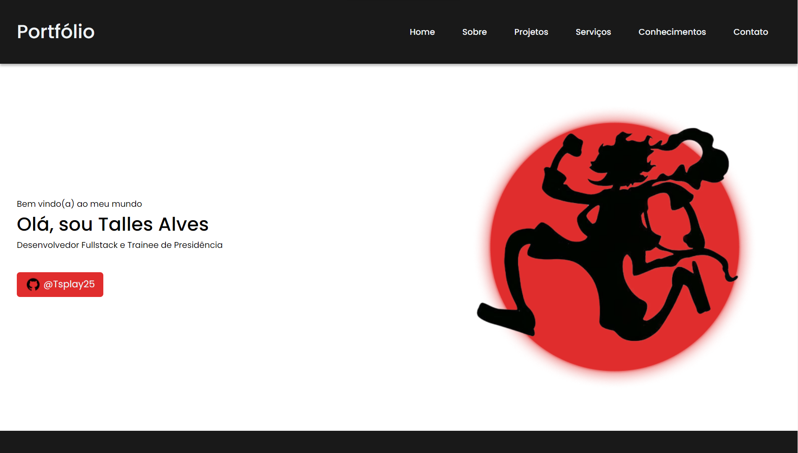

# Portfolio - Talles Alves

Site desenvolvido durante o trainee da empresa junior Byron Solutions, abordando o básico das tecnologias web: HTML e CSS.

**Design original:https://www.figma.com/file/dheY31nA3UgmLIwvUKR7NO/Portf%C3%B3lio-Curso?node-id=0%3A1**
 
**Playlist das aulas: https://www.youtube.com/playlist?list=PLc77ERAwzB_1gKZMGke5504UIv_nRWWQ_** 
